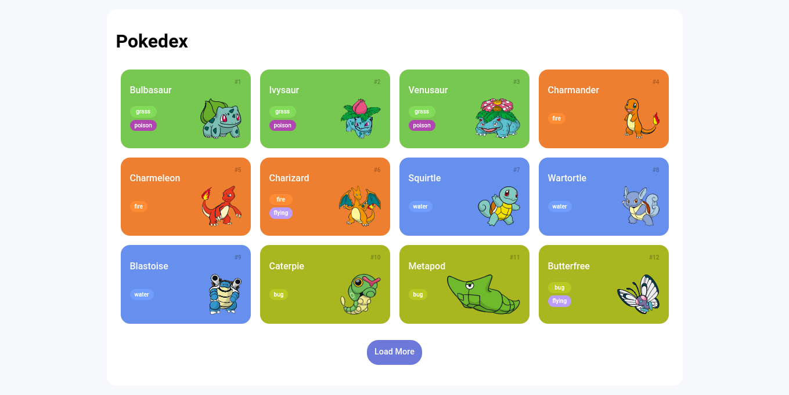

<h1 align="center">Pokedex</h1>

<h2 align="center">
</a>
</h2>

  
  
  

## (:blue_book) About
Pokedex is a project made to consume an API and display Pokemons and their information.

## (:hammer_and_pick) Tools
##### Technologies
- HTML5
- CSS3
- JavaScript

##### API
- PokéAPI

## (:page_facing_up_) License
This project is under the MIT license. See the [LICENSE](https://github.com/elainefs/bootcamps-dio/blob/main/LICENCE) file for more details.

Made with :heart by [Elaine Ferreira](https://github.com/elainefs)
