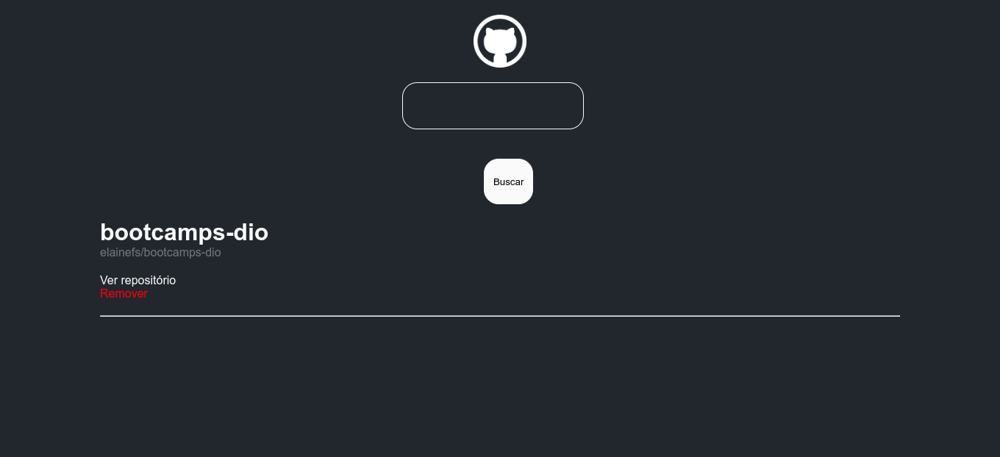

<h1 align="center">Wiki GitHub</h1>

<h2 align="center">
</a>
</h2>

  
  

## 📘 About
ReactJS application to list repositories when consuming the GitHub API.

## ⚒️ Tools
##### Technologies
- React JS
- Styled Components
- GitHub API

## 📄 License
This project is under the MIT license. See the [LICENSE](https://github.com/elainefs/bootcamps-dio/blob/main/LICENCE) file for more details.

Made with ❤️ by [Elaine Ferreira](https://github.com/elainefs)